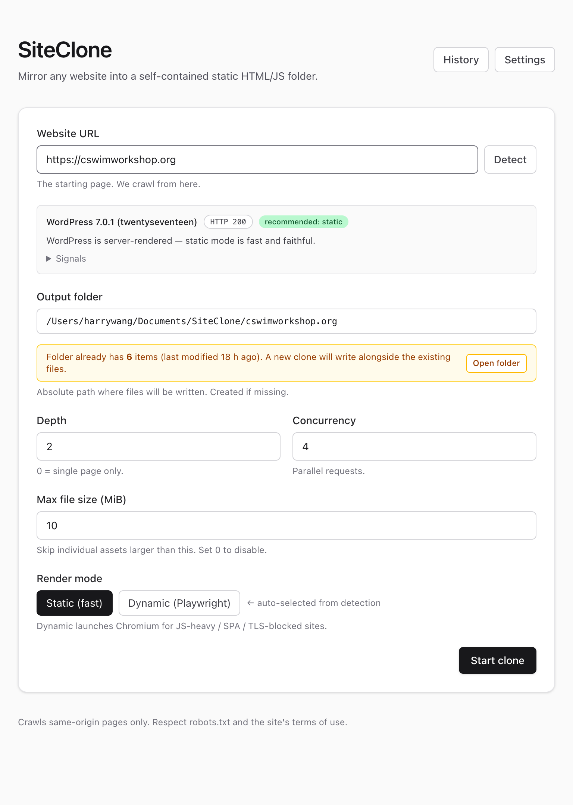

# SiteClone

Mirror any website into a self-contained static HTML/JS folder — a desktop app
for Mac and Windows. Paste a URL, get a folder you can open in a browser or drop
on any static host.



## Download

Grab the latest installer from
**[Releases](https://github.com/harrywang/siteclone/releases)**:

- **Mac** — `SiteClone-<version>.dmg` (Intel + Apple Silicon)
- **Windows** — `SiteClone-Setup-<version>.exe`

No Node.js or command line needed. The app opens a window, you paste a URL, it
writes the folder.

> The Mac build is unsigned. On first launch, right-click the app → **Open**, or
> allow it under System Settings → Privacy & Security.

## What it does

- **Detects the site first** — reports the tech stack (WordPress, SPA, etc.) and
  recommends Static or Dynamic before you clone.
- **Static mode** — `fetch` + cheerio, fast, faithful for server-rendered sites.
- **Dynamic mode** — renders with headless Chromium (Playwright) for JS-heavy /
  SPA / TLS-fingerprint-blocked sites.
- **Rewrites everything local** — HTML, CSS `url(...)`, `srcset`, and assets
  referenced only from JavaScript, so the folder has no dependency on the
  original host. Handles WordPress quirks (lazy images, Uncode themes).
- **Output** goes to `~/Documents/SiteClone/<host>/` — open `index.html`
  directly, or host on S3 / Netlify / GitHub Pages.

## Run from source

```bash
git clone https://github.com/harrywang/siteclone.git
cd siteclone
npm install
npm run electron:dev     # build + open as a desktop app
```

Or run just the web UI during development:

```bash
npm run dev              # Next.js on http://localhost:3000
```

For Dynamic mode, install Chromium once (or point `PLAYWRIGHT_CHROMIUM_PATH` at
an existing Chrome/Edge):

```bash
npx playwright install chromium
```

### Command-line

No app needed — clone straight from the terminal:

```bash
npx tsx scripts/clone-cli.ts https://example.com ~/Documents/SiteClone/example.com
```

Useful flags: `--depth N`, `--mode static|dynamic`, `--concurrency N`,
`--max-file-size MB`, `--host-ip <ip>` (reach a site whose DNS is gone but whose
server still answers), `--seeds <file>` (extra start URLs when the front page is
unreachable).

## Build installers

```bash
npm run electron:build:mac   # → dist-electron/SiteClone-<v>.dmg
npm run electron:build:win   # → dist-electron/SiteClone Setup <v>.exe
npm run electron:build:all   # both
```

## License

AGPL-3.0
